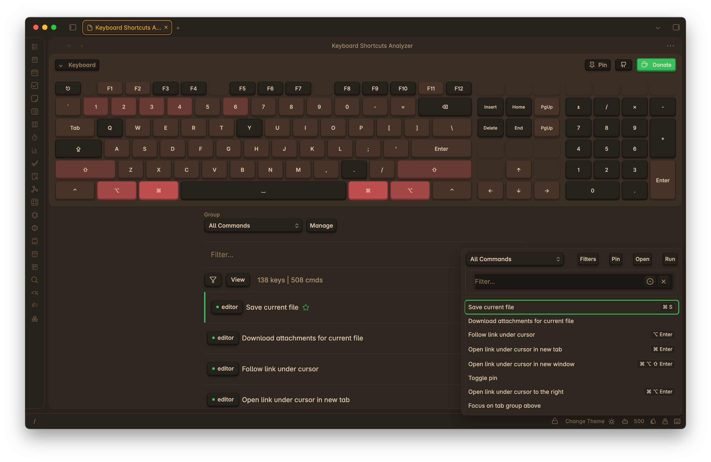

# Keyboard Analyzer — Obsidian Plugin

Visualize, search, and analyze your Obsidian hotkeys on a keyboard layout. Quickly spot duplicates and gaps, filter by scope, and optionally include system/editor defaults so you don’t assign over common shortcuts.

Install from Community Plugins: https://obsidian.md/plugins?id=keyboard-analyzer

## Features

- Visual keyboard [REFACTOR]: see which keys are used and by which commands
- Powerful search: by key combo (e.g., `Ctrl+K`), command name, plugin
- Duplicates and gaps: highlight conflicts and unassigned areas
- Grouping [NEW] [WIP]: Assign commands to groups, configure group settings and filtration
- Quick View Popup [NEW]: Quick access to commands list with option run commands (Run command twice to start with key listener enabled)
- Modifier activation mode [NEW]: Option to select how active key listener tracks modifier keys - On hold or toggle
- Key listener scope [NEW]: Allow to set key listener scope (e.g., global, plugin view)
- System default overlay: avoid colliding with OS/editor shortcuts ([See default keys](docs/system-shortcuts.md))
- Status-bar entry: click to open quick commands popup

## Roadmap

- [ ] Hotkey assignment management: allow users to create, edit, and delete hotkey assignments
- [ ] Settings migration: persist user settings across updates
- [ ] Visual Keyboard Configuration: allow users to customize the visual keyboard layout
- [ ] Additional key support: allow support of F13-F24, Meh and Hyper Keys

## Installation

Recommended — Community Plugins

- Obsidian → Settings → Community plugins → Browse
- Search “Keyboard Analyzer” (or open the link above)
- Install and enable

Alternative — BRAT / Manual

- BRAT: install Obsidian42 BRAT → “Add beta plugin” → paste repo URL → enable
- Manual: download `main.js`, `styles.css`, `manifest.json` from Releases and place in `[Vault]/.obsidian/plugins/obsidian-keyboard-analyzer/`

More details: `docs/installation.md`.

## Using the Plugin

Open

- Status bar: click the keyboard icon to open quick commands popup
- Command palette: “Keyboard Analyzer: Open Shortcuts View”

Search and filter

- Search by combo (e.g., `Cmd+Shift+K`), command name, plugin, or scope
- Toggle: Filter → “Include system defaults” to overlay common OS/editor shortcuts
- Highlights show duplicates and unassigned areas

## Compatibility & Privacy

- Platforms: Windows, macOS, Linux.
- Privacy: no analytics; nothing leaves your machine.

## Changelog

See `CHANGELOG.md` for release notes.

## Contributing & Support

- Found a bug or have an idea? Please open an issue.
- If this plugin helps you, a [Ko‑fi](https://ko-fi.com/S6S5E6K74) is appreciated 🤍.

## Thanks

- Inspiration and help from the Obsidian community, including
  [@SkepticMystic](https://github.com/SkepticMystic), [@HEmile](https://github.com/HEmile),
  [@pjeby](https://github.com/pjeby), [@Fevol](https://github.com/Fevol), and others.

MIT License — see `LICENSE`.
